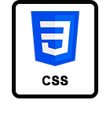
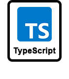
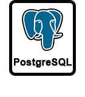
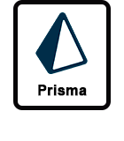
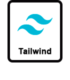
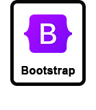
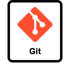

   
   <h2 align="center">¡Hey 👋🏻! Soy Camilo Gil 👨🏻‍💻</h3>

Soy <strong>Desarrollador Full Stack</strong> e <strong>ingeniero mecánico</strong> de Bogotá, Colombia. Como ingeniero mecánico, tengo una alta capacidad de resolución de problemas, y como desarrollador web, puedo crear aplicaciones interactivas, versátiles y altamente escalables. Me encanta aprender y siempre busco expandir mis habilidades y conocimientos en el campo de la ingeniería y el desarrollo web. Trabajo en equipo y valoro la colaboración para lograr resultados excepcionales en cada proyecto que emprendo.

  <h2 align="center">Mis habilidades Técnicas Destacadas 👇🏻</h3>
  

  
  
  
  
  
  
  
  
  
  
  
  
  
  
  
  
  

<h2 align="center">Conóceme un Poco Mas 😁</h3>
  

    
    
  

  

    
  
  

