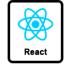
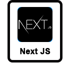

    

      

        Hola, soy Camilo Gil, un desarrollador web full stack e ingeniero mecánico de Bogotá, Colombia. Como ingeniero
        mecánico,
        tengo una alta capacidad de resolución de problemas, y como desarrollador web, puedo crear aplicaciones
        interactivas,
        versátiles y altamente escalables. Me encanta aprender y siempre busco expandir mis habilidades y conocimientos
        en
        el
        campo de la ingeniería y el desarrollo web. Trabajo en equipo y valoro la colaboración para lograr resultados
        excepcionales en cada proyecto que emprendo.
      

      
    

    

      <h2 class="skills_title">Habilidades Técnicas</h2>
      

        

          
          JavaScript
        

        

          
          HTML
        

        

          
          CSS
        

        

          
          React
        

        

          
          React Native
        

        

          
          Node Js
        

        

          
          TypeScript
        

        

          

            
          

          Next Js
        

        

          

            
          

          Express
        

        

          
          Mongo DB
        

        

          
          PostgreSQL
        

        

          
          Prisma
        

        

          

            
          

          Sass
        

        

          

            
          

          Tailwind
        

        

          

            
          

          Bootstrap
        

        

          
          Git
        

      

    

    

      <h2 class="know_me_title">Conóceme un Poco Mas</h2>
      

        <a href="https://www.camilogilfranco.tech/" target="_blank" class="know_me_button"
          onmouseover="this.style.transform='scale(1.2)';" onmouseout="this.style.transform='scale(1)';">
          
          Portafolio
        </a>
        <a href="https://www.linkedin.com/in/adrian-camilo-gil-franco/" target="_blank"
          class="know_me_button"
          onmouseover="this.style.transform='scale(1.2)';" onmouseout="this.style.transform='scale(1)';">
          
          LikedIn
        </a>
      

      

        
        camilogilfranco@gmail.com
      

    

  

